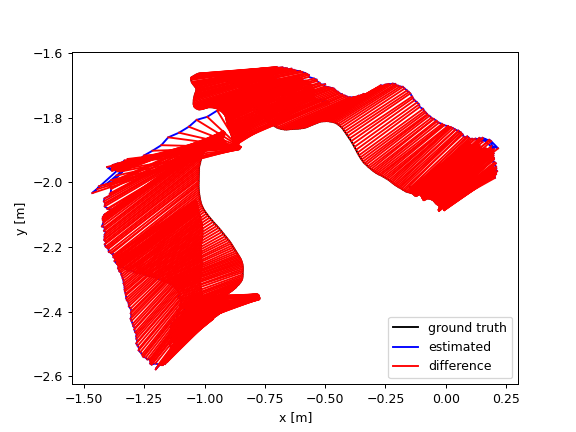
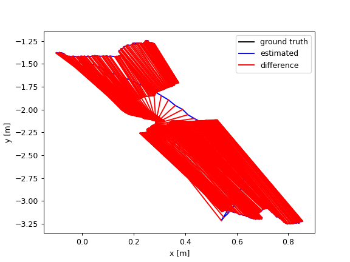
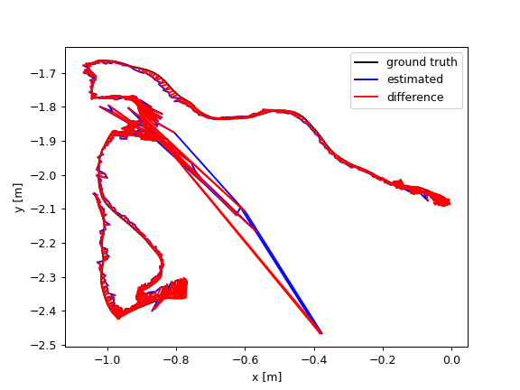
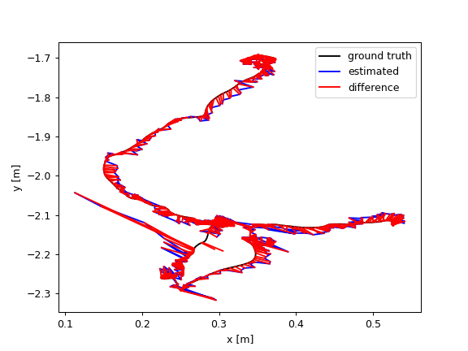

# ORB-SLAM3-Dynamic-Scene

This repository is a modified version of [ORB_SLAM3](https://github.com/UZ-SLAMLab/ORB_SLAM3) by removing dynamic feature points in the scene, improved ATE of different scenes from [Bonn RGB-D Dynamic Dataset](https://www.ipb.uni-bonn.de/data/rgbd-dynamic-dataset/index.html) up to 97.4%.

|   |Moving_nonobstructing_box|Placing_nonobstructing_box|
|---|---|---|
|Origin|||
|ATE (m)|0.342640|0.754891|
|SfM Pruning|||
|ATE (m)|0.030402|0.019903|
|GIF|||

From the result, we can clearly see that, the dynamic feature points are removed once it is detected moving in a different direction than the majority of the other feature points. And after it is steady, the feature points are added back into the MapPoints for Pose-Graph optimization. With this optimization, we gained an huge improvement when mapping a scene with dynamic object using ORB-SLAM3, up to 97.4% improvement is seen.

## Environment
- Succesfully tested in **Ubuntu 24.04** (with OpenCV 4.6.0)

## How to build
0. Clone the repo
1. Install Eigen3==3.4.0, 
```
sudo apt install libeigen3-dev
```
2. Install OpenCV==4.6.0 and ros-jazzy-cv-bridge==4.1.0
```
sudo apt install libopencv-dev
``` 
3. Install Pangolin==v0.9.2
```
sudo apt install libepoxy-dev

# Clone it in the root path where you cloned orb-slam3
git clone https://github.com/stevenlovegrove/Pangolin
cd ./Pangolin
git checkout v0.9.2
mkdir build
cd build
cmake ..
make
```
4. Install ORB-SLAM3
 ```
 cd $ORB_SLAM3_ROOT_PATH/ORB-SLAM3
chmod +x build.sh

./build.sh
```
5. Install Sophus
```
cd $ORB_SLAM3_ROOT_PATH/ORB-SLAM3/ThirdParty/Sophus/build
sudo make install
```

## Run the code
1. Get [Bonn RGB-D Dynamic Dataset](https://www.ipb.uni-bonn.de/data/rgbd-dynamic-dataset/index.html), then create a associate.txt with preprocess.py
```
python preprocess.py --file_root SCENE_DATASET_PATH
```

2. Run the code
```
./Examples/RGB-D/rgbd_tum \
    ./Vocabulary/ORBvoc.txt \
    ./Examples/RGB-D/TUM3.yaml \
    SCENE_DATASET_ROOT_PATH \
    SCENE_DATASET_ASSOCIATION_TXT
```

3. Run ATE Evaluation
```
python ./evaluation/evaluate_ate_tum.py \
    GT_Trajectory \
    SLAM_Trajectory \
```

## Parameters Adjustment
To have different performance, adjust the strictness for removing feature points moving in different directions in `Tracking.cc` line 2914 and line 2974
```
// Sort the angles into different amount size of bins
const int num_bins = 360;

// Angle acceptance
const int threshold = 2.0;
```